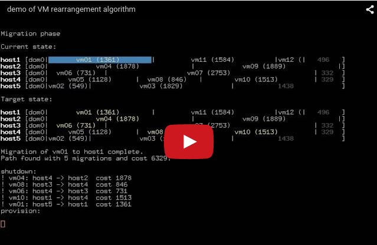

VM migration path finder
========================

Overview
--------

In a populated compute cloud, there are several scenarios in which
it's beneficial to be able to rearrange VM guest instances into a
different placement across the hypervisor hosts via migration (live or
otherwise), using a policy based on some business need, such as
optimising performance or maximising return on hardware investment.

In [this blog post](http://blog.adamspiers.org/cloud-rearrangement), I
went into more detail on these scenarios, took a look at the status
quo in OpenStack and the computer science behind the problem, and
briefly mentioned that I have a working implementation of an algorithm
which reliably calculates a reasonably optimal sequence of VM
migrations from a given initial placement to a given final placement.
This repository provides the code for that implementation.  Here it is
in action:

Algorithm
---------

For more details on the algorithm design and implementation, please
see [`doc/algorithm.md`](doc/algorithm.md).

Usage
-----

The code is provided as a set of Python classes in [the `src/`
directory](src/), but there are several frontend interfaces with which
you can run the algorithm directly:

*   [`src/animate.py`](src/animate.py) - for a single (current, target) state pair, finds a
    path of migrations from one to the other and animates the
    sequence via an ASCII representation, showing one migration
    per keypress.
*   [`src/debug.py`](src/debug.py) - runs the solver on one of
    [the fixed testcases](testcases/fixed.py), outputting verbose debugging
    information as it goes.  Useful for examining in detail exactly how the
    algorithm works.
*   [`src/demo.py`](src/demo.py) - randomly generates (current, target) state pairs,
    finds a migration between them, and animates the solution via an ASCII
    representation.
*   [`src/repl.py`](src/repl.py) - REPL interface which lets you manually specify
    migrations one at a time.
*   [`src/soaktest.py`](src/soaktest.py) - randomly generates (current, target) state pairs, launches
    the path finder on them, and flags any runs which took longer
    than a time threshold.  This helps highlight issues
    (performance and otherwise) in the algorithm.
*   [`src/test.py`](src/test.py) - a test runner which runs the algorithm on
    some hardcoded scenarios and checks the results

Code structure
--------------

The backend code implementing the algorithm comprises of the following files:

*   [`src/pathfinder.py`](src/pathfinder.py) - base class providing container for
    state used during path discovery
*   [Strategy](http://en.wikipedia.org/wiki/Strategy_pattern) subclasses:
    *   [`src/dijkstra.py`](src/dijkstra.py) - naive Dijkstra implementation I
        implemented first but which turned out to be completely
        useless due to the algorithmic complexity of the path graph
        which needs to be explored
    *   [`src/aspiers.py`](src/aspiers.py) - [my algorithm](ALGORITHM.md)

This code is supported by several OO helper classes:

*    [`src/vm.py`](src/vm.py) - models a single VM (RAM / architecture requirements)
*    [`src/vmhost.py`](src/vmhost.py) - models a single VM hypervisor host
*    [`src/vmmigration.py`](src/vmmigration.py) - models a single live migration of a
     VM from one host to another
*    [`src/vmpoolstate.py`](src/vmpoolstate.py) - models a pool of VMs and VM hosts
     together with a particular placement of the VMs across the VM hosts.
*    [`src/vmpoolpath.py`](src/vmpoolpath.py) - models an ordered sequence of VM shutdowns,
     migrations, and provisions, between two VM pool states
*    [`src/vmpoolstateerrors.py`](src/vmpoolstateerrors.py) - exception classes
     for use when indicating
*    [`src/vodict.py`](src/vodict.py) - an implementation of a value-ordered dictionary,
     which is only used by the (useless) [`src/dijkstra.py`](src/dijkstra.py)

Development / support / feedback
--------------------------------

Please see [the CONTRIBUTING file](CONTRIBUTING.md).

License
-------

This repository is released under [the Apache 2.0
license](http://www.apache.org/licenses/LICENSE-2.0.txt) in order to
be compatible with [the OpenStack
project](https://www.openstack.org/); however I am open to the idea of
dual-licensing if anyone needs this.

Acknowledgements
----------------

Thanks to the awesomeness of my employer [SUSE](http://www.suse.com/),
once or twice a year I get to work on whatever I want for a whole
week.  We call it [Hack Week]([https://hackweek.suse.com/])!  And I've
actually been (*very* sporadically) working in my spare time on
designing and implementing this algorithm for the last four years or
so.  So for Hack Week 10 (7th--11th October 2013), I decided to
finally complete this proof of concept implementation.  Embarrassingly,
it took me until May 2015 to publish the code and blog about it, but
better late than never ...

History
-------

I became fascinated with the potential of using orchestration
techniques to optimise large-scale virtualized environments around
2007 or so, when I was a data center architect working in
[Novell](https://www.novell.com/home/)'s sales division.  Around that
time, Novell acquired a small Californian company called RedMojo,
together with some amazing orchestration / virtualization management
technology which became ZenWorks Orchestrator.  It was later rebranded
as PlateSpin Orchestrate in 2008 after Novell's acquisition of
PlateSpin, which had also [some very interesting virtualization
environment optimization
technology](https://www.netiq.com/products/recon/).  

As an orchestration engine, PlateSpin Orchestrate was way ahead of its
time, and I had fun building demonstrations of the huge potential of
policy-based management of large-scale virtualized environments.  I
left the sales division to join the engineering team for PlateSpin
Orchestrate, and it eventually became the backend for [NetIQ Cloud
Manager](https://www.netiq.com/products/cloud-manager/).

These experiences got me thinking about possible generalized solutions
to the problem of optimizing large-scale virtualized environments,
and so the ideal for this path-finding approach was born.
